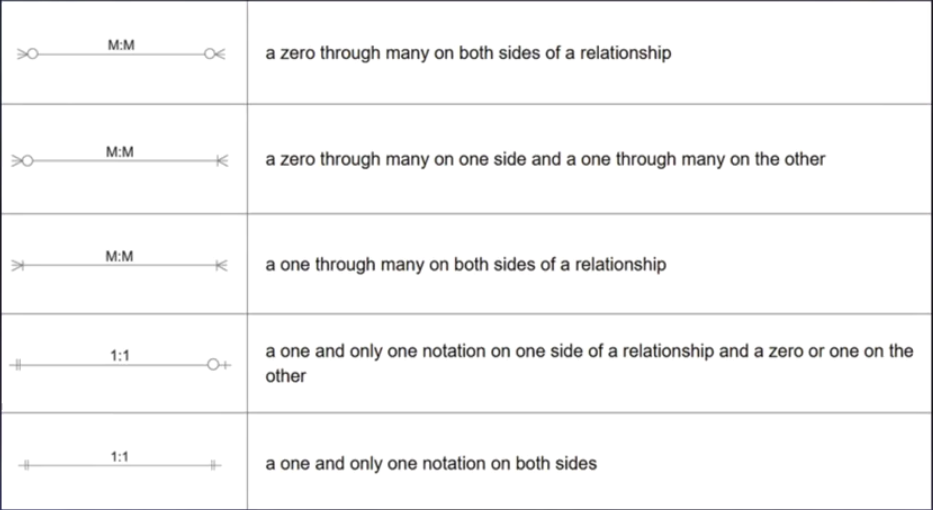

এবার আমরা রিলোশিন পির এর বিভিন্ন সাইন এর সাথে পরিচিত হবো । এই সাইন গুলো দেখার মাধ্যমে আমরা যে ভিজুয়াল ডায়াগ্রাম আছে ডাটাবেইজ এর যাকে আমরা ER Diagram বা entity relationship diagram বলি। এই ডায়াগ্রামে যে সাইন গুলো ব্যবহার হয় এগুলো আমরা ভালোভাবে বুঝে গেলে

এই যে রিলেশন শিপ এর সাইন গুলো আছে এদের উপর ভিত্তি করে আমরা পরবর্তিতে শিখবো ER Diagram। এবং ER ডায়াগ্রাম দেখে আমরা বুঝতে পারবো এতে আসলে কি বুঝাতে চাচ্ছে। কোন টেবিলের সাথে কোন টেবিল এর কি রিলেশানশিপ বুঝাতে চাচ্ছে।

আপনি যে ছবিটি শেয়ার করেছেন তাতে আমরা ডাটাবেজের `Entity-Relationship Diagram (ERD)`-এ ব্যবহৃত বিভিন্ন রিলেশনশিপের চিহ্ন বা চিহ্ননির্দেশক দেখে সম্পর্কগুলো কিভাবে চিত্রিত হয়, তা বুঝতে পারি। এগুলো ব্যবহার করে আমরা টেবিলগুলোর মধ্যে সম্পর্ক নির্ধারণ করতে পারি।

### মূল চিহ্নগুলো:

1. **One (1:1)** - একটি সত্ত্বা (entity) অন্য একটি সত্ত্বার সাথে কেবলমাত্র একটি সম্পর্ক স্থাপন করতে পারে।
2. **Many (1:M or M:1)** - একটি সত্ত্বা অনেকগুলোর সাথে সম্পর্কযুক্ত হতে পারে।
3. **One and Only One (1:1)** - একটি সত্ত্বা কেবলমাত্র একটি নির্দিষ্ট সত্ত্বার সাথে সম্পর্কিত হতে পারে।
4. **Zero or One (0..1)** - একটি সত্ত্বা হয় শূন্য বা একটির সাথে সম্পর্ক স্থাপন করতে পারে।
5. **One or Many (1..M)** - একটি সত্ত্বা এক বা একাধিক সত্ত্বার সাথে সম্পর্কিত হতে পারে।
6. **Zero or Many (0..M)** - একটি সত্ত্বা শূন্য অথবা একাধিক সত্ত্বার সাথে সম্পর্কিত হতে পারে।

### সংক্ষেপে সম্পর্কের ধরন:

1. **One to One (1:1)** - যখন একটি সত্ত্বা আরেকটি সত্ত্বার সাথে কেবলমাত্র একটি সম্পর্ক স্থাপন করতে পারে। যেমন: একটি ব্যক্তির একটি জাতীয় পরিচয়পত্র।
2. **One to Many (1:M)** - একটি সত্ত্বা একাধিক সত্ত্বার সাথে সম্পর্ক স্থাপন করতে পারে। যেমন: একজন শিক্ষকের একাধিক ছাত্র থাকতে পারে।

3. **Many to One (M:1)** - অনেক সত্ত্বা একটি নির্দিষ্ট সত্ত্বার সাথে সম্পর্কযুক্ত হতে পারে। যেমন: অনেক ছাত্র একজন শিক্ষকের অধীনে পড়তে পারে।

4. **Many to Many (M:M)** - অনেক সত্ত্বা একাধিক সত্ত্বার সাথে সম্পর্কিত হতে পারে। যেমন: একজন ছাত্র একাধিক ক্লাসে ভর্তি হতে পারে, আবার একটি ক্লাসে অনেক ছাত্র থাকতে পারে।

5. **Zero to Many (0:M)** - কোনও সত্ত্বা হয় শূন্য বা একাধিক সত্ত্বার সাথে সম্পর্কিত হতে পারে। যেমন: কোনও ব্যক্তি শূন্য অথবা একাধিক গাড়ি কিনতে পারে।

### ER Diagram কীভাবে কাজ করে:

ER Diagram তৈরি করার সময়, আমরা সত্ত্বা এবং তাদের মধ্যে সম্পর্ক কীভাবে চিত্রিত করবো তা বুঝতে এই চিহ্নগুলি ব্যবহার করি। প্রতিটি চিহ্ন সম্পর্কের ধরনের দিকনির্দেশনা দেয় যা আমাদের ডাটাবেসের কাঠামো নির্ধারণে সাহায্য করে। উদাহরণস্বরূপ, যদি কোনও টেবিলের একটি টেবিলের সাথে অনেক সম্পর্ক থাকে, তবে আমরা 1:M সম্পর্কের চিহ্ন ব্যবহার করবো। এভাবে চিহ্নগুলো দেখে খুব সহজেই আমরা ডাটাবেসের মূল কাঠামো এবং সম্পর্কগুলো বুঝতে পারি।

**ER Diagram** এর মাধ্যমে আপনি কীভাবে টেবিলগুলোর সম্পর্ক চিত্রিত করবেন তা শেখা অত্যন্ত গুরুত্বপূর্ণ, কারণ এর মাধ্যমে ডাটাবেসের যুক্তিসঙ্গত ডিজাইন তৈরি করা সহজ হয়।
